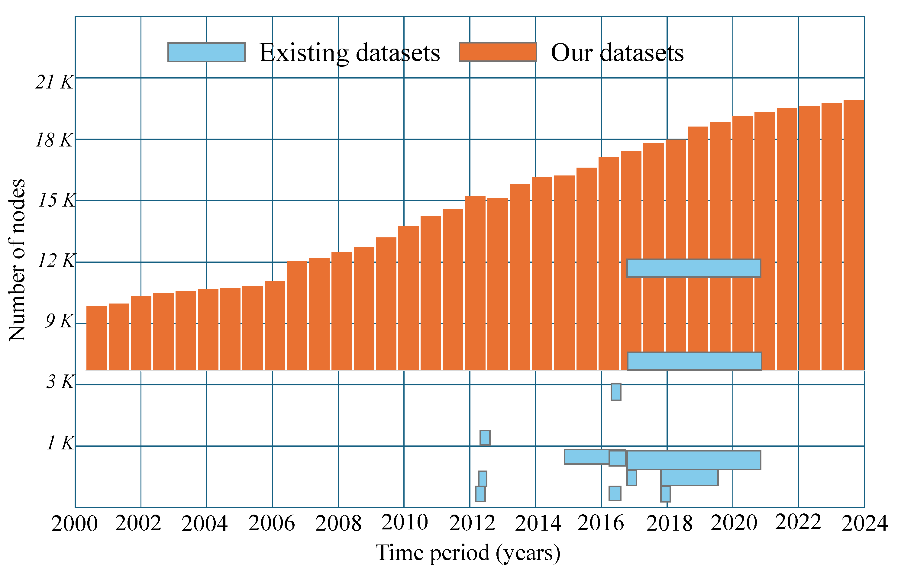
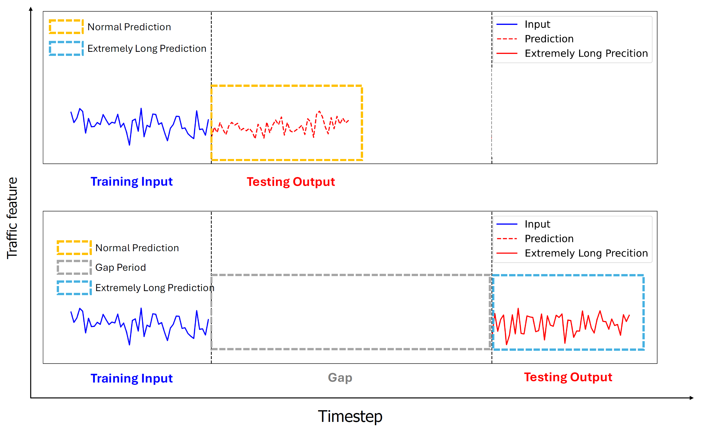
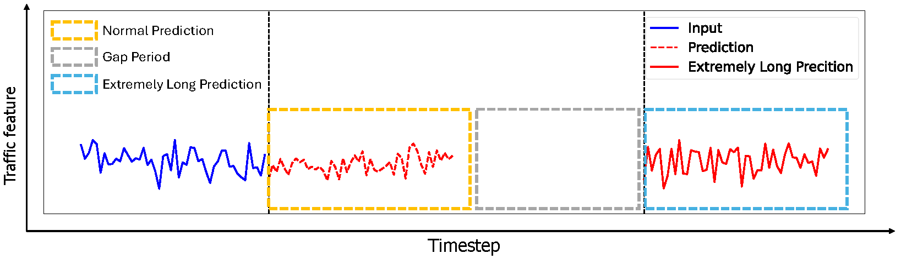
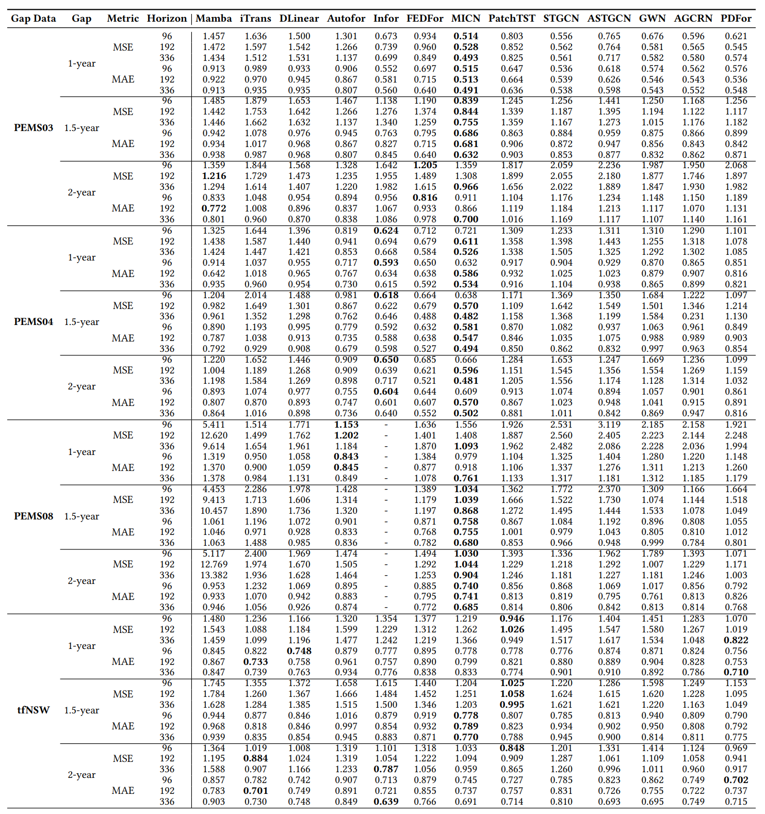

# **XXLTraffic: Expanding and Extremely Long Traffic Dataset for Ultra-Dynamic Forecasting Challenges**. [[ArXiv](https://arxiv.org/abs/2406.12693)]

We propose XXLTraffic, a dataset that spans up to 23 years and exhibits evolutionary growth. It includes data from 9 regions, with detailed data collection and processing procedures for expansion and transformation. This dataset supports both temporally scalable and spatially scalable challenges in traffic prediction.We also present an experimental setup with temporal gaps for extremely long prediction with gaps scenarios and provide a benchmark of aggregated versions of hourly and daily datasets.


# Abstract

Traffic forecasting is crucial for smart cities and intelligent transportation initiatives, where deep learning has made significant progress in modeling complex spatio-temporal patterns in recent years. However, current public datasets have limitations in reflecting the ultra-dynamic nature of real-world scenarios, characterized by continuously evolving infrastructures, varying temporal distributions, and temporal gaps due to sensor downtimes or changes in traffic patterns. These limitations inevitably restrict the practical applicability of existing traffic forecasting datasets. To bridge this gap, we present XXLTraffic, the largest available public traffic dataset with the longest timespan and increasing number of sensor nodes over the multiple years observed in the data, curated to support research in ultra-dynamic forecasting. Our benchmark includes both typical time-series forecasting settings with hourly and daily aggregated data and novel configurations that introduce gaps and down-sample the training size to better simulate practical constraints. We anticipate the new XXLTraffic will provide a fresh perspective for the time-series and traffic forecasting communities. It would also offer a robust platform for developing and evaluating models designed to tackle ultra-dynamic and extremely long forecasting problems. Our dataset supplements existing spatio-temporal data resources and leads to new research directions in this domain.


# Dataset

## Data introduction:

Our dataset are evolving and longer than existing datasets. Existing datasets are either limited by short temporal spans or insufficient spatial nodes. In contrast, our dataset features an evolving growth of spatial nodes and spans over 20 years.

## Data description:

| Dataset        | Data Points | Sensors | Interval | Duration     | Date Range        |
|----------------|-------------|---------|----------|--------------|-------------------|
| **Full_PEMS03**| 2,419,488   | 1,809   | 5 mins   | 23.00 years  | 03/2001 - 03/2024 |
| **Full_PEMS04**| 2,287,872   | 4,089   | 5 mins   | 21.75 years  | 06/2002 - 03/2024 |
| **Full_PEMS05**| 1,998,720   | 573     | 5 mins   | 19.00 years  | 03/2005 - 03/2024 |
| **Full_PEMS06**| 1,945,728   | 705     | 5 mins   | 18.50 years  | 09/2005 - 03/2024 |
| **Full_PEMS07**| 2,287,872   | 4,888   | 5 mins   | 21.75 years  | 06/2002 - 03/2024 |
| **Full_PEMS08**| 2,419,488   | 2,059   | 5 mins   | 23.00 years  | 03/2001 - 03/2024 |
| **Full_PEMS10**| 1,998,720   | 1,378   | 5 mins   | 19.00 years  | 03/2005 - 03/2024 |
| **Full_PEMS11**| 2,261,376   | 1,440   | 5 mins   | 21.50 years  | 09/2002 - 03/2024 |
| **Full_PEMS12**| 2,331,360   | 2,587   | 5 mins   | 22.16 years  | 01/2002 - 03/2024 |

| Datasets(Gap/Hour/Day) | Time Period       | Nodes |
|------------------------|-------------------|-------|
| **PEMS03_Agg**         | 03/2001 - 03/2024 | 151   |
| **PEMS04_Agg**         | 06/2002 - 03/2024 | 822   |
| **PEMS05_Agg**         | 03/2012 - 03/2024 | 103   |
| **PEMS06_Agg**         | 12/2009 - 03/2024 | 130   |
| **PEMS07_Agg**         | 06/2002 - 03/2024 | 1613  |
| **PEMS08_Agg**         | 03/2001 - 03/2024 | 212   |
| **PEMS10_Agg**         | 06/2007 - 03/2024 | 107   |
| **PEMS11_Agg**         | 09/2002 - 03/2024 | 521   |
| **PEMS12_Agg**         | 01/2002 - 03/2024 | 867   |

## Data overview

XXLTraffic dataset overview and its evolving development. This figure provides a global overview and two local overviews, showcasing the diversity of sensor distribution. The lower parts highlights a selected region to illustrate the growth and changes in traffic sensors over time.


Sensor traffic status distribution of District 8 from 2005 to 2024. While some sensors exhibit minimal changes, others show significant distribution differences, regardless of whether they are in low-traffic or high-traffic areas. This presents substantial challenges for extremely long forecasting with long gaps.


## Data download

#### The sample data include gap data, hourly data and daily data are included in pems05.zip:

- Gap data: pems05_all_common_flow.csv
- Hourly data: pems05_h.csv
- Daily data: pems05_d.csv

How to preprocess the raw data to make gap data, hourly data and daily data is also provided in ```data``` filepath

## Benchmarking

Our benckmarking is based on Time-Series-Library:
- Time-Series-Library: https://github.com/thuml/Time-Series-Library

Our benchmark setting: The yellow boxes represent typical predictions, the gray boxes denote
gap periods between observation and prediction, and the blue boxes indicate extended predictions.


Results of Extremely Long Forecasting with gaps:


Results of ablation study with 4 different input step lengths:


Results of hourly and daily datasets:


## License

The XXLTraffic dataset is licensed under CC BY-NC 4.0 International: https://creativecommons.org/licenses/by-nc/4.0. Our code is available under the MIT License: https://opensource.org/licenses/MIT. Please check the official repositories for the licenses of any specific baseline methods used in our codebase.

